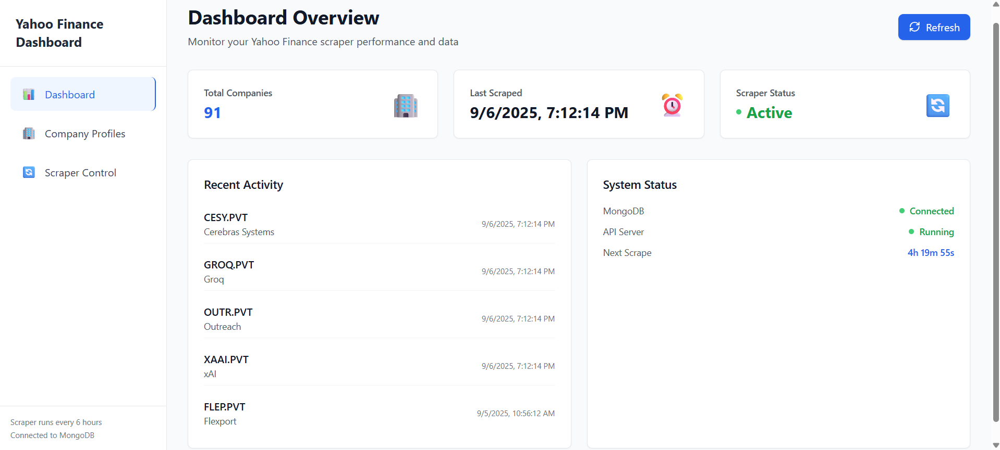
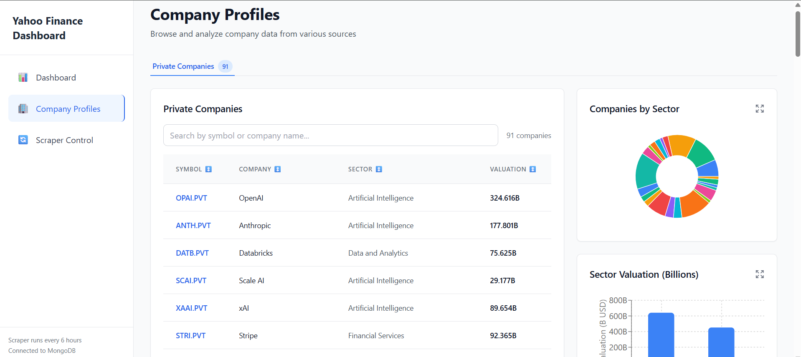

# 💜 Yahoo Finance Scraper & Dashboard  

[]() []() []() [](https://yahoo-finance-nine.vercel.app/)  

---

## 🚀 Overview  
A **full-stack web app** that scrapes **Yahoo Finance private companies data** and presents it in a sleek, interactive dashboard.  
- 🕵️‍♂️ **Scraping** with Puppeteer + cron jobs (auto-updates every 6 hrs)  
- ⚡ **Backend**: Node.js + Express REST API  
- 📊 **Frontend**: React + Vite + Recharts (smooth, fast, interactive)  
- 🗄 **Database**: MongoDB (deduped, semi-structured storage)  
- 🎨 **UI**: Clean, responsive, purple-themed  

---

## 🛠 Features  
- 🔄 **Automated Scraping** → Puppeteer + node-cron (retry mechanism included 💪)  
- 🌐 **REST API** → Companies, Symbols, Stats, Trigger Scraper  
- 📈 **Interactive Dashboard** → Charts + Stats with Recharts  
- 🧾 **Company Table** → Search, filter, and browse scraped companies  
- 🚦 **Scraper Control** → One-click scraper trigger from frontend  
- ⚡ **Fast Build** → Powered by Vite (zero lag, instant HMR in dev)  

---

## 📂 Project Structure  

```bash
📦 project-root
┣ 📂 backend   # Node.js + Express + Puppeteer + MongoDB
┣ 📂 frontend  # React (Vite, Recharts, Lucide, Headless UI)
┣ 📂 logs      # Cron job & scraper logs
┗ README.md

```

---

## 🔗 Live Demo  
👉 [**Check it out here**](https://yahoo-finance-nine.vercel.app/)  

---

## 📸 Screenshots  
### Dashboard  
  

### Companies Table  
  

---

## ⚙️ Tech Stack  
- **Frontend:** React (Vite, Recharts, Headless UI, Lucide React)  
- **Backend:** Node.js, Express, Puppeteer, node-cron  
- **Database:** MongoDB (Atlas)  
- **Deployment:** Vercel (Frontend) + GCP VM (Backend Scraper)  

---

## 🏁 Getting Started  

### 1️⃣ Clone Repo  
```bash
git clone https://github.com/your-username/yahoo-finance-scraper.git
cd yahoo-finance-scraper
# Backend
cd backend
npm install

# Frontend
cd ../frontend
npm install
# Start backend
npm run dev

# Start frontend
npm run dev
```
🤝 Contributing

Contributions are always welcome! 🎉

Fork it

Create your branch (git checkout -b feature/awesome)

Commit (git commit -m 'Added something cool')

Push (git push origin feature/awesome)

Open a PR 🚀

📜 License

This project is licensed under the MIT License.

🌟 Show Some Love

If you like this project, drop a ⭐ on GitHub — it keeps the purple vibes alive 💜
